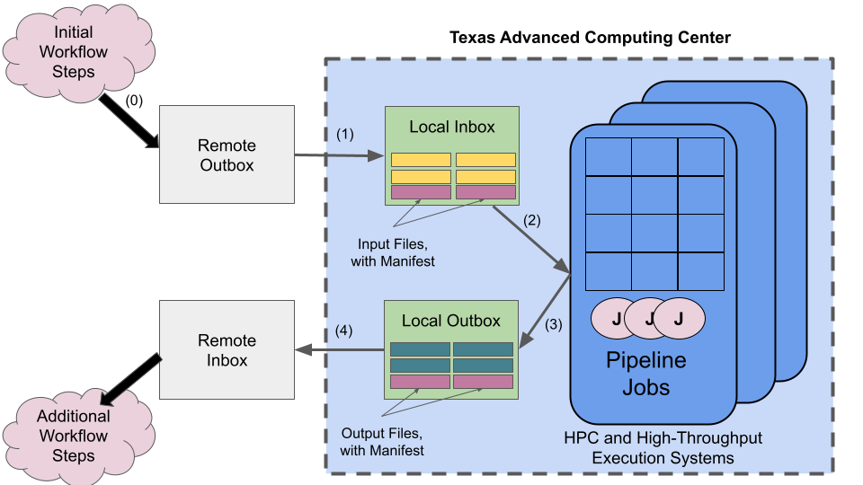

===============
Tapis Pipelines
===============

Welcome to the Tapis Pipelines documentation.

What are Tapis Pipelines?
_________________________
Tapis Pipelines automate data analysis workflows on TACC Cloud and HPC resources in a secure, robust, and
fault-tolerant way. The Tapis Pipelines software integrates directly with the Tapis v3 API Framework to
allow users to define workflows that incorporate Tapis services such as the Tapis Metadata, Actors (functions-as-a-service),
Systems, Apps, Jobs and other services.

Tapis Pipelines have been architected to fit within broader data analysis processing workflows where only a part of the
computation actually runs at TACC. This work grew out of collaborations with NASA JPL and partners to support
the processing of data (exposures) captured by the NEID telescope instrument at Kitt Peak National Observatory. Partner
institutions included Caltech, IPAC (Infrared Processing & Analysis Center), JPL, Kitt Peak, Penn State, and the
University of Arizona.

There are two ways to build Tapis pipelines. First, the Tapis Pipelines software is available as a Python package that
can be installed and configured directly on a Linux-compliant machine. This method is available today and provides the
ability to customize the Pipeline software itself, offering the most flexibility. The second method, currently in development,
is to utilize the Tapis Pipelines Service, a hosted version of the software developed and maintained by TACC staff.

10,000 Foot View
----------------
At a high level, each Tapis Pipeline consists of the following simple steps:

  1. Files to be processed are copied to the pipeline's configured *Remote Outbox*.
  2. As new files arrive in the Remote Outbox, they are staged to the pipeline's configured *Local Inbox* at TACC where
     basic validation and pre-processing can occur.
  3. The pipeline's configured *entrypoint* is launched to "process" files in the Local Inbox. Each execution of the entrypoint
     is referred to as a *pipeline job*.
  4. On successful completion of a pipeline job, output files are copied to the pipeline's *Local Outbox* at TACC where
     validation of the outputs and postprocessing occurs.
  5. Finally, files in the Local Outbox are transferred to the pipeline's configured *Remote Inbox*.

For each step above, there are several configurable aspects, and the software includes mechanisms for ensuring robustness
and integrity of the pipeline processing.

Some of the most salient aspects include:

  1. The Remote Inbox can be configured to be a Globus endpoint or a path on a Tapis system, including a POSIX directory on
     systems available via SSH (e.g., SFTP) and a location in an object store (e.g., AWS S3 buckets).
  2. Files staged to the Remote Inbox include *manifest files*
  2. The Local Inbox is configured in conjunction with where the pipeline jobs will run (which execution host). For
     example, the Local Inbox could make use of TACC's global file system, Stockyard, a scratch file system on one of
     the HPC systems,
  3. Pipeline jobs are configured with one or more execution targets, a *primary* and optionally, one or more *secondary*
     systems at TACC where pipeline jobs will actually run. These can be traditional HPC supercomputers or cloud/high-throughput
     systems. When a primary system is offline, for example, due to a planned maintenance, jobs will be automatically routed
     to a secondary system. (Note: support
  4. Each pipeline configuration includes a *run schedule* which dictates how new pipeline jobs are scheduled. The options
     include a fixed schedule, similar to cron (e.g., run every day at 2 AM), or *streaming*, which runs jobs as soon as
     new manifest files arrive in the Local Inbox.

